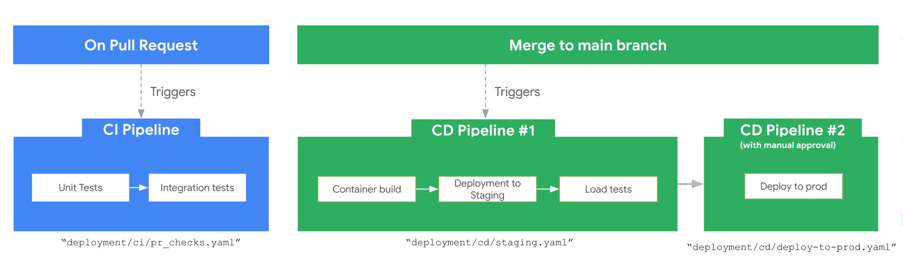

# CI/CD & Production

Set up a CI/CD pipeline that tests on pull request, deploys to staging on merge, and promotes to production with manual approval.



---

## How the Pipeline Works

1. **CI Pipeline** (triggered on pull request):
    - Runs unit and integration tests.

2. **Staging CD Pipeline** (triggered on merge to `main`):
    - Builds and pushes a container to Artifact Registry.
    - Deploys to the **staging environment**.
    - Runs automated load testing.

3. **Production Deployment** (triggered after successful staging):
    - Requires **manual approval** before proceeding.
    - Deploys the same container image tested in staging.

---

## Set Up the Pipeline

Run a single command to provision infrastructure and configure CI/CD:

```bash
agents-cli infra cicd \
  --staging-project my-staging-project \
  --prod-project my-prod-project
```

This handles:

- **Infrastructure provisioning** via Terraform for staging and production
- **CI/CD configuration** with your chosen runner (Cloud Build or GitHub Actions)
- **Repository connection** to GitHub

### CI/CD Runner Detection

| Runner | How It's Detected |
|--------|-------------------|
| GitHub Actions | Auto-detected from `wif.tf` in your project. Uses Workload Identity Federation for keyless auth. |
| Google Cloud Build | Auto-detected from Terraform config. Sets up Cloud Build connection to GitHub. |

### Options

| Flag | Description |
|------|-------------|
| `--staging-project` | GCP project ID for staging (required) |
| `--prod-project` | GCP project ID for production (required) |
| `--cicd-project` | Separate project for CI/CD resources (defaults to prod) |
| `--dev-project` | Dev project (optional, provisions dev infra too) |
| `--repository-name` | GitHub repository name |
| `--repository-owner` | GitHub repository owner |
| `--local-state` | Use local Terraform state instead of GCS |
| `--create` | Create a new GitHub repository (omit to use an existing one) |

---

## Terraform Variables

The pipeline uses Terraform variables defined in `deployment/terraform/variables.tf`:

| Variable | Description |
|----------|-------------|
| `project_name` | Base name for resource naming |
| `prod_project_id` | Google Cloud project ID for production |
| `staging_project_id` | Google Cloud project ID for staging |
| `cicd_runner_project_id` | Google Cloud project ID where CI/CD pipelines execute |
| `region` | Google Cloud region (default: `us-west1`) |
| `repository_name` | GitHub repository name |
| `repository_owner` | GitHub username or organization |
| `app_sa_roles` | Roles for the application service account |
| `cicd_roles` | Roles for CI/CD runner service account |

---

Once deployed, register your agent with Gemini Enterprise using `agents-cli publish gemini-enterprise`. Run with `--help` for all options.
