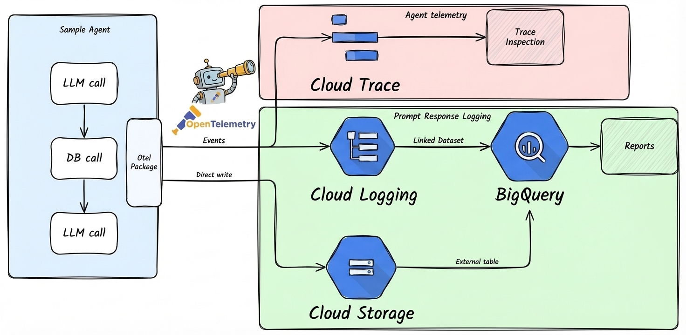

# Cloud Trace

*For developers who have deployed an agent and want to verify tracing works and inspect telemetry data.*



Cloud Trace is enabled by default in all `agents-cli` projects. This guide shows how to verify it works and query your telemetry data.

---

## Verify Tracing in Your Deployment

After deploying to your development environment, confirm telemetry data is flowing:

### 1. Deploy and Generate Test Traffic

```bash
gcloud config set project YOUR_DEV_PROJECT_ID
agents-cli deploy
```

Send a few test requests to your agent.

### 2. View Traces

Open the Google Cloud Console and navigate to **Trace > Trace explorer**. You should see traces for each request, with spans showing LLM calls and tool executions.

### 3. Verify Prompt-Response Logging (Optional)

Prompt-response logging captures model interactions to GCS and BigQuery. It's enabled by default in deployed environments.

```bash
PROJECT_ID="your-dev-project-id"
PROJECT_NAME="your-project-name"

# Check for telemetry files in GCS
gsutil ls gs://${PROJECT_ID}-${PROJECT_NAME}-logs/completions/

# Query telemetry in BigQuery
bq query --use_legacy_sql=false \
  "SELECT * FROM \`${PROJECT_ID}.${PROJECT_NAME}_telemetry.completions\` LIMIT 10"
```

If data isn't appearing:

1. Check that the service account has the `storage.objectCreator` role.
2. Verify `LOGS_BUCKET_NAME` is set in your deployment environment variables.
3. Check application logs in Cloud Logging for telemetry setup warnings.

---

## Enable Prompt-Response Logging Locally

By default, `agents-cli playground` runs **without** prompt-response logging. To enable it locally (ADK agents only):

```bash
export LOGS_BUCKET_NAME="gs://your-dev-project-id-your-project-name-logs"
export OTEL_INSTRUMENTATION_GENAI_CAPTURE_MESSAGE_CONTENT="NO_CONTENT"
agents-cli playground
```

---

## Disable Prompt-Response Logging in Deployments

To disable it in a deployed environment, edit `deployment/terraform/[dev/]service.tf`:

```hcl
env {
  name  = "OTEL_INSTRUMENTATION_GENAI_CAPTURE_MESSAGE_CONTENT"
  value = "false"
}
```

Then apply:

```bash
cd deployment/terraform
terraform apply -var-file=vars/dev.tfvars
```

---

## Configuration Reference

| Variable | Values | Purpose |
|---|---|---|
| `LOGS_BUCKET_NAME` | GCS bucket path | Required for prompt-response logging. If not set, logging is disabled. |
| `OTEL_INSTRUMENTATION_GENAI_CAPTURE_MESSAGE_CONTENT` | `false`, `NO_CONTENT`, `true` | `false` = disabled, `NO_CONTENT` = metadata only (default), `true` = full content |
| `GENAI_TELEMETRY_PATH` | Path within bucket | Override upload path for prompt-response logs |

